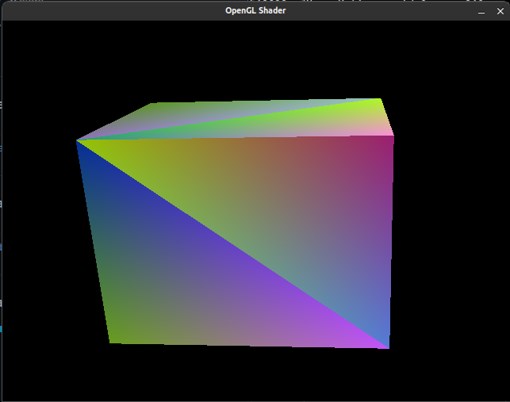

# Rendering a cube with Go and OpenGL

aka: Go + Opengl 2.1 + Shaders + VertexAttribPointer

## Introduction

This is a spike showing how to use Golang (1.18) to open a window, render a cube and use vertex and fragment shaders (this makes use of CGO under the hood)

It has only been (slightly) tested on Mac and Linux.

## Usage

- run `go mod tidy`
- then `make run` or `go run .`

if something goes wrong, you might need to install your systems OpenGL development libraries.

## More Info

I haven't been able to find an example of how to do this online anywhere.  There are a few exampls of each part, but nothing that puts them all togther - specfically using the pointer part of _VertexAttribPointer_ with OpenGL 2.1.  Later versions seem to have a nicer way to go about this, but anyone playing around on an older hardware can't use OpenGL 3.3.

This has fragments from my real project. It has just enough to make it work - no tests, etc. This should only be used as an example or starting point, but hopefully it'll save you days of hitting your head against the table :)

The main thing you're likely missing is, you *have* to lookup the attrib location:

    posLoc := gl.Uint(gl.GetAttribLocation(program, gl.GLString("Pos")))
    colorLoc := gl.Uint(gl.GetAttribLocation(program, gl.GLString("Color")))

And then you can do the offset by passign a nil pointer:

    gl.VertexAttribPointer(posLoc, 3, gl.FLOAT, gl.FALSE, bpe, gl.Offset(nil, uintptr(0)))
    gl.VertexAttribPointer(colorLoc, 3, gl.FLOAT, gl.FALSE, bpe, gl.Offset(nil, uintptr(3*sizeOfFloat)))
